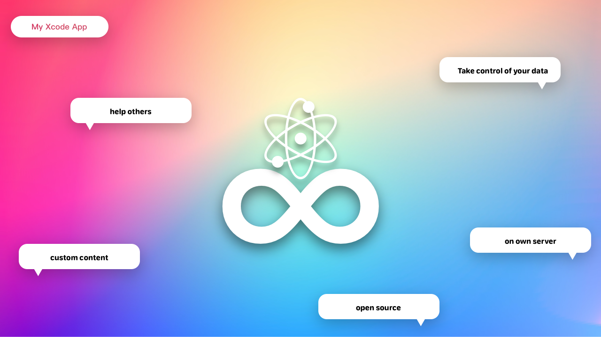

# Endless-Api



## Introduce
Hear is endless-api open source library.
Endless-Api is used to manage files, users and tokens, but it doesn't provide uploading files function.
To use this library, you must have a **Xcode(>13)**, and you should **finish all warnings**.
Endless App haven't supported this custom Api, you need to wait for a time.
Some functions like SwiftECC, you need to see the original packages to finish it.
It may be not the latest version of Endless-Api.
You can contribute to this library, we will combine your code to our private library.

## Run

```
vapor run
```

or

Use Run button of **Xcode**

## Build

For Debug:
```
vapor build
```

For Release
```
swift build -c release
```

## Database

You must run this command befor `build/run`.

```
vapor run migrate
```
